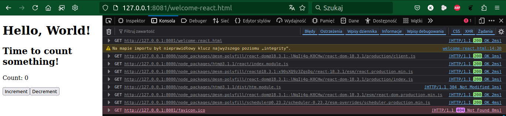
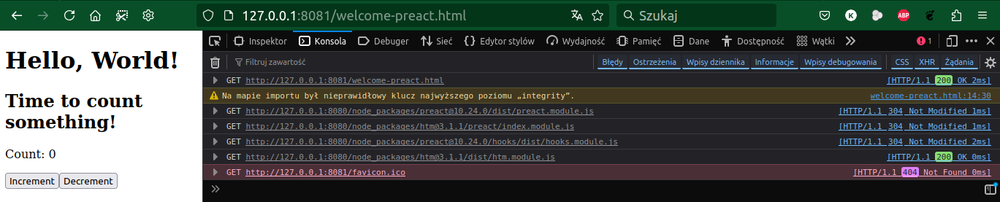

# @user3232/importmap


importmap's generated from runtime!.

This CLI generates importmap's from `node`
package and its dependencies installed locally. 

It allows for traditional workflow, but its usage
may be benfitial. You work as you usually work
and at the end you generate universal importmap,
automaticaly fetches its needed packages and
host them whereever you like (see tutorial
and requirements below).


CLI generates few files:

* importmap heaving paths set to local directories,
* importmap heaving global unique names,
* caches for commands
* fetch specification for downloading packages
  on remotes for global importmaps. (see also
  [user3232/importmap-fetch](https://github.com/user3232/importmap-fetch))


## Usage

Install:

```sh
npm install --save-dev user3232/importmap
```

Use CLI to generate/rebase/inject importmaps:

```sh
# cli help
npx importmap help

# generate importmap's for browser, import enviroment:
#   local -> [browser,import].importmap.local.json
#   global -> [browser,import].importmap.global.json
npx importmap build browser import

# importmaps can be rebased, to
# rebase importmap to origin and path:
npx importmap rebase http://localhost:3333 /static/

# importmap can be injected into htmls heaving 
# <script type="importmap"></script> tag:
npx importmap inject '[browser,import].importmap.local.json' *.html

```

Create some `.html` files and serve them:

```sh
npx http-server
```

That's it!.

## Features

* Maps `package.json`: `exports` (conditional, self-referense, ...), 
  `imports` (conditional, self-referense, ...) and `main` (using `type`)
  to importmap module specifier map.
* Maps packages dependencies and dependencies dependencies and ...,
  to importmap scopes.
* Dependencies are resolved in accordance to node ESM resolution algorithm.
* Produces global importmap - uses universal names computed by fixing to particular packages
  versions and dependencies versions recursively as node see it locally.
  Global (universal) importmap is universal deployment unit, it can be thought
  as equivalent to rust cargo packages locks. This allows for global registers/CDN's/etc.
  with packages reuse and without collisions.
* Produces local importmap - uses local directories names, ready to use
  for local development.
* Produces global importmap fetch specification. Can be used to fetch 
  packages used by global importmap on remote machine. (Global importmaps
  are universal.).
* Safe!!!, global/local importmaps are produced with integity of all files
  used by importmap participating packages, that means if something differs
  integrity constraints will be vailated. That way deployments runs are safe
  when hosting importmap files anywhere.

## Requirements

If app wish to use importmap's generated by @user3232/importmap in
browser, **all local packages that will be used in browser** (not
neccessarly all packages) must offer ESM exports (imports) and use
only browser API. 

So for example if app depends on preact, and preact
and (all its browser runtime dependencies) offers ESM export's,
importmap's will works without any further work. In contrast
oryginal react does not offer ESM exports so it will not work
without transpiling to ESM. 

Converting package and its dependencies to ESM's is generally
not trivial, but can be done, see: 
* https://github.com/orgs/esm-polyfill/repositories ,
* https://github.com/nodejs/cjs-module-lexer 

or there are services offering ESM versins of some packages:
* https://esm.sh/ (grat work, respect!),
* https://jspm.org/cdn/jspm-io (grat work, respect!).


## Tutorial

We will create 2 app's:
* first (web page) will serve `.html`'s with importmap's,
* second (CDN) will serve globally named packages.

### Web page app

Install dependencies:

```sh

mkdir web-app
cd web-app
npm init -y
npm i @user3232/importmap --save-dev
npm i http-server --save-dev
npm i htm
npm i preact
npm i esm-polyfill/react-dom
npm i esm-polyfill/react

```

Create `.html` files `welcome-preact.html` and `welcome-react.html`:

```html
<!doctype html>
<html lang="en-US">
<head>
  <meta charset="UTF-8" >
  <title>Imortmap preact showcase</title>
</head>
<body>
    <script type="importmap">
    </script>

    <div id="app"></div>

    <script type="module">
        import { render } from 'preact'
        import { html } from 'htm/preact'
        import { useState } from 'preact/hooks'

        function Counter() {
            const [count, setCount] = useState(0);
            const increment = () => setCount(count + 1);
            const decrement = () => setCount((currentCount) => currentCount - 1);

            return html`
                <div>
                    <p>Count: ${count}</p>
                    <button onClick=${increment}>Increment</button>
                    <button onClick=${decrement}>Decrement</button>
                </div>
            `
        }

        function App() {
            return html`
                <h1>Hello, World!</h1>
                <h2>Time to count something!</h2>
                <${Counter} />
            `
        }

        render(
            html`<${App} />`, 
            document.getElementById('app')
        )
    </script>
</body>
```

```html
<!doctype html>
<html lang="en-US">
<head>
  <meta charset="UTF-8" >
  <title>Imortmap react showcase</title>
</head>
<body>
    <script type="importmap">
    </script>

    <div id="app"></div>

    <script type="module">
        import { createRoot } from 'react-dom/client'
        import { html } from 'htm/react'
        import { useState } from 'react'

        function Counter() {
            const [count, setCount] = useState(0);
            const increment = () => setCount(count + 1);
            const decrement = () => setCount((currentCount) => currentCount - 1);

            return html`
                <div>
                    <p>Count: ${count}</p>
                    <button onClick=${increment}>Increment</button>
                    <button onClick=${decrement}>Decrement</button>
                </div>
            `
        }

        function App() {
            return html`
                <h1>Hello, World!</h1>
                <h2>Time to count something!</h2>
                <${Counter} />
            `
        }

        const reactRoot = createRoot(document.getElementById('app'))
        reactRoot.render(html`<${App} />`)
    </script>
</body>
```

Now generate importmaps and inject them to html:

```sh
# Create importmaps (local and global)
# (browser and import are declared enviroment features)
npx importmap build browser import

# rebase global importmap to http://127.0.0.1:3233/node_packages/
npx importmap rebase --origin http://127.0.0.1:3233 /node_packages/

# inject global importmap into html's
npx importmap inject '[browser,import].importmap.global.json' *.html

# serve files
npx http-serve --port 3232 --cors

```

### CDN app

Install dependencies:

```sh

# leave web-app
cd ..
mkdir cdn-app
cd cdn-app
npm init -y
npm i @user3232/importmap-fetch --save-dev
npm i http-server --save-dev

```

Fetch web-app dependencies and serve files:

```sh
# copy importmap spec cwd
cp ../web-app/*.importmap.spec.json .
# fetch all spec'es in cwd
npx importmap-fetch 
# serve files
npx http-serve --3233 --cors
```

### result


```sh
# open browser and see results:
xdg-open http://127.0.0.1:3232/welcome-preact.html
xdg-open http://127.0.0.1:3232/welcome-react.html
```






Spec file could (your packages deps resolution may differ => name hash
part will differ) look like this:

```json
{
  "@esm-polyfill/react-dom@18.3.1:-lNqIj4q-K0CHw": "github:esm-polyfill/react-dom#semver:18.3.1",
  "@esm-polyfill/react@18.3.1:x90sXQ9z3ZqsDg": "github:esm-polyfill/react#semver:18.3.1",
  "@esm-polyfill/scheduler@0.23.2": "github:esm-polyfill/scheduler#semver:0.23.2",
  "@types/prop-types@15.7.13": "npm:@types/prop-types@15.7.13",
  "csstype@3.1.3": "npm:csstype@3.1.3",
  "htm@3.1.1": "npm:htm@3.1.1",
  "importmap-use@1.0.1:0WgRR0gF3AEDaQ": "git+file:///home/mk/github/lib/importmap-use#semver:latest",
  "preact@10.24.0": "npm:preact@10.24.0"
}
```


Global importmap looks like this (it may differs because specyfic
package resulutions may change with for example dependency patch,
so there will be different package hash in name):

```json
{
  "imports": {
    "htm": "http://127.0.0.1:8080/node_packages/htm@3.1.1/dist/htm.module.js",
    "htm/": "http://127.0.0.1:8080/node_packages/htm@3.1.1/",
    "htm/preact": "http://127.0.0.1:8080/node_packages/htm@3.1.1/preact/index.module.js",
    "htm/preact/standalone": "http://127.0.0.1:8080/node_packages/htm@3.1.1/preact/standalone.module.js",
    "htm/react": "http://127.0.0.1:8080/node_packages/htm@3.1.1/react/index.module.js",
    "htm/mini": "http://127.0.0.1:8080/node_packages/htm@3.1.1/mini/index.module.js",
    "preact": "http://127.0.0.1:8080/node_packages/preact@10.24.0/dist/preact.module.js",
    "preact/compat": "http://127.0.0.1:8080/node_packages/preact@10.24.0/compat/dist/compat.module.js",
    "preact/debug": "http://127.0.0.1:8080/node_packages/preact@10.24.0/debug/dist/debug.module.js",
    "preact/devtools": "http://127.0.0.1:8080/node_packages/preact@10.24.0/devtools/dist/devtools.module.js",
    "preact/hooks": "http://127.0.0.1:8080/node_packages/preact@10.24.0/hooks/dist/hooks.module.js",
    "preact/test-utils": "http://127.0.0.1:8080/node_packages/preact@10.24.0/test-utils/dist/testUtils.module.js",
    "preact/jsx-runtime": "http://127.0.0.1:8080/node_packages/preact@10.24.0/jsx-runtime/dist/jsxRuntime.module.js",
    "preact/jsx-dev-runtime": "http://127.0.0.1:8080/node_packages/preact@10.24.0/jsx-runtime/dist/jsxRuntime.module.js",
    "preact/compat/client": "http://127.0.0.1:8080/node_packages/preact@10.24.0/compat/client.mjs",
    "preact/compat/server": "http://127.0.0.1:8080/node_packages/preact@10.24.0/compat/server.browser.js",
    "preact/compat/jsx-runtime": "http://127.0.0.1:8080/node_packages/preact@10.24.0/compat/jsx-runtime.mjs",
    "preact/compat/jsx-dev-runtime": "http://127.0.0.1:8080/node_packages/preact@10.24.0/compat/jsx-dev-runtime.mjs",
    "preact/compat/scheduler": "http://127.0.0.1:8080/node_packages/preact@10.24.0/compat/scheduler.mjs",
    "preact/package.json": "http://127.0.0.1:8080/node_packages/preact@10.24.0/package.json",
    "preact/compat/package.json": "http://127.0.0.1:8080/node_packages/preact@10.24.0/compat/package.json",
    "preact/debug/package.json": "http://127.0.0.1:8080/node_packages/preact@10.24.0/debug/package.json",
    "preact/devtools/package.json": "http://127.0.0.1:8080/node_packages/preact@10.24.0/devtools/package.json",
    "preact/hooks/package.json": "http://127.0.0.1:8080/node_packages/preact@10.24.0/hooks/package.json",
    "preact/test-utils/package.json": "http://127.0.0.1:8080/node_packages/preact@10.24.0/test-utils/package.json",
    "preact/jsx-runtime/package.json": "http://127.0.0.1:8080/node_packages/preact@10.24.0/jsx-runtime/package.json",
    "react": "http://127.0.0.1:8080/node_packages/@esm-polyfill/react@18.3.1:x90sXQ9z3ZqsDg/react-18.3.1/esm/react.production.min.js",
    "react/package.json": "http://127.0.0.1:8080/node_packages/@esm-polyfill/react@18.3.1:x90sXQ9z3ZqsDg/package.json",
    "react/jsx-runtime": "http://127.0.0.1:8080/node_packages/@esm-polyfill/react@18.3.1:x90sXQ9z3ZqsDg/react-18.3.1/esm/react-jsx-runtime.production.min.js",
    "react/jsx-dev-runtime": "http://127.0.0.1:8080/node_packages/@esm-polyfill/react@18.3.1:x90sXQ9z3ZqsDg/react-18.3.1/esm/react-jsx-dev-runtime.production.min.js",
    "react-dom": "http://127.0.0.1:8080/node_packages/@esm-polyfill/react-dom@18.3.1:-lNqIj4q-K0CHw/react-dom-18.3.1/production/index.js",
    "react-dom/client": "http://127.0.0.1:8080/node_packages/@esm-polyfill/react-dom@18.3.1:-lNqIj4q-K0CHw/react-dom-18.3.1/production/client.js",
    "react-dom/server": "http://127.0.0.1:8080/node_packages/@esm-polyfill/react-dom@18.3.1:-lNqIj4q-K0CHw/react-dom-18.3.1/production/server.browser.js",
    "react-dom/server.browser": "http://127.0.0.1:8080/node_packages/@esm-polyfill/react-dom@18.3.1:-lNqIj4q-K0CHw/react-dom-18.3.1/production/server.browser.js",
    "react-dom/server.node": "http://127.0.0.1:8080/node_packages/@esm-polyfill/react-dom@18.3.1:-lNqIj4q-K0CHw/react-dom-18.3.1/production/server.node.js",
    "react-dom/profiling": "http://127.0.0.1:8080/node_packages/@esm-polyfill/react-dom@18.3.1:-lNqIj4q-K0CHw/react-dom-18.3.1/production/profiling.js",
    "react-dom/test-utils": "http://127.0.0.1:8080/node_packages/@esm-polyfill/react-dom@18.3.1:-lNqIj4q-K0CHw/react-dom-18.3.1/production/test-utils.js",
    "react-dom/package.json": "http://127.0.0.1:8080/node_packages/@esm-polyfill/react-dom@18.3.1:-lNqIj4q-K0CHw/package.json",
    "#htm/preact": "http://127.0.0.1:8080/node_packages/htm@3.1.1/preact/index.module.js"
  },
  "scopes": {
    "http://127.0.0.1:8080/node_packages/@esm-polyfill/react-dom@18.3.1:-lNqIj4q-K0CHw/": {
      "@esm-polyfill/react-dom": "http://127.0.0.1:8080/node_packages/@esm-polyfill/react-dom@18.3.1:-lNqIj4q-K0CHw/react-dom-18.3.1/production/index.js",
      "@esm-polyfill/react-dom/client": "http://127.0.0.1:8080/node_packages/@esm-polyfill/react-dom@18.3.1:-lNqIj4q-K0CHw/react-dom-18.3.1/production/client.js",
      "@esm-polyfill/react-dom/server": "http://127.0.0.1:8080/node_packages/@esm-polyfill/react-dom@18.3.1:-lNqIj4q-K0CHw/react-dom-18.3.1/production/server.browser.js",
      "@esm-polyfill/react-dom/server.browser": "http://127.0.0.1:8080/node_packages/@esm-polyfill/react-dom@18.3.1:-lNqIj4q-K0CHw/react-dom-18.3.1/production/server.browser.js",
      "@esm-polyfill/react-dom/server.node": "http://127.0.0.1:8080/node_packages/@esm-polyfill/react-dom@18.3.1:-lNqIj4q-K0CHw/react-dom-18.3.1/production/server.node.js",
      "@esm-polyfill/react-dom/profiling": "http://127.0.0.1:8080/node_packages/@esm-polyfill/react-dom@18.3.1:-lNqIj4q-K0CHw/react-dom-18.3.1/production/profiling.js",
      "@esm-polyfill/react-dom/test-utils": "http://127.0.0.1:8080/node_packages/@esm-polyfill/react-dom@18.3.1:-lNqIj4q-K0CHw/react-dom-18.3.1/production/test-utils.js",
      "@esm-polyfill/react-dom/package.json": "http://127.0.0.1:8080/node_packages/@esm-polyfill/react-dom@18.3.1:-lNqIj4q-K0CHw/package.json",
      "scheduler": "http://127.0.0.1:8080/node_packages/@esm-polyfill/scheduler@0.23.2/scheduler-0.23.2/esm-overrides/scheduler.production.min.js",
      "scheduler/unstable_mock.js": "http://127.0.0.1:8080/node_packages/@esm-polyfill/scheduler@0.23.2/scheduler-0.23.2/esm/scheduler-unstable_mock.production.min.js",
      "scheduler/unstable_post_task.js": "http://127.0.0.1:8080/node_packages/@esm-polyfill/scheduler@0.23.2/scheduler-0.23.2/esm/scheduler-unstable_post_task.production.min.js",
      "scheduler/package.json": "http://127.0.0.1:8080/node_packages/@esm-polyfill/scheduler@0.23.2/package.json",
      "react": "http://127.0.0.1:8080/node_packages/@esm-polyfill/react@18.3.1:x90sXQ9z3ZqsDg/react-18.3.1/esm/react.production.min.js",
      "react/package.json": "http://127.0.0.1:8080/node_packages/@esm-polyfill/react@18.3.1:x90sXQ9z3ZqsDg/package.json",
      "react/jsx-runtime": "http://127.0.0.1:8080/node_packages/@esm-polyfill/react@18.3.1:x90sXQ9z3ZqsDg/react-18.3.1/esm/react-jsx-runtime.production.min.js",
      "react/jsx-dev-runtime": "http://127.0.0.1:8080/node_packages/@esm-polyfill/react@18.3.1:x90sXQ9z3ZqsDg/react-18.3.1/esm/react-jsx-dev-runtime.production.min.js"
    },
    "http://127.0.0.1:8080/node_packages/@esm-polyfill/react@18.3.1:x90sXQ9z3ZqsDg/": {
      "@esm-polyfill/react": "http://127.0.0.1:8080/node_packages/@esm-polyfill/react@18.3.1:x90sXQ9z3ZqsDg/react-18.3.1/esm/react.production.min.js",
      "@esm-polyfill/react/package.json": "http://127.0.0.1:8080/node_packages/@esm-polyfill/react@18.3.1:x90sXQ9z3ZqsDg/package.json",
      "@esm-polyfill/react/jsx-runtime": "http://127.0.0.1:8080/node_packages/@esm-polyfill/react@18.3.1:x90sXQ9z3ZqsDg/react-18.3.1/esm/react-jsx-runtime.production.min.js",
      "@esm-polyfill/react/jsx-dev-runtime": "http://127.0.0.1:8080/node_packages/@esm-polyfill/react@18.3.1:x90sXQ9z3ZqsDg/react-18.3.1/esm/react-jsx-dev-runtime.production.min.js",
      "@types/prop-types": "http://127.0.0.1:8080/node_packages/@types/prop-types@15.7.13",
      "csstype": "http://127.0.0.1:8080/node_packages/csstype@3.1.3"
    },
    "http://127.0.0.1:8080/node_packages/csstype@3.1.3/": {
      "csstype": "http://127.0.0.1:8080/node_packages/csstype@3.1.3"
    },
    "http://127.0.0.1:8080/node_packages/@types/prop-types@15.7.13/": {
      "@types/prop-types": "http://127.0.0.1:8080/node_packages/@types/prop-types@15.7.13"
    },
    "http://127.0.0.1:8080/node_packages/@esm-polyfill/scheduler@0.23.2/": {
      "@esm-polyfill/scheduler": "http://127.0.0.1:8080/node_packages/@esm-polyfill/scheduler@0.23.2/scheduler-0.23.2/esm-overrides/scheduler.production.min.js",
      "@esm-polyfill/scheduler/unstable_mock.js": "http://127.0.0.1:8080/node_packages/@esm-polyfill/scheduler@0.23.2/scheduler-0.23.2/esm/scheduler-unstable_mock.production.min.js",
      "@esm-polyfill/scheduler/unstable_post_task.js": "http://127.0.0.1:8080/node_packages/@esm-polyfill/scheduler@0.23.2/scheduler-0.23.2/esm/scheduler-unstable_post_task.production.min.js",
      "@esm-polyfill/scheduler/package.json": "http://127.0.0.1:8080/node_packages/@esm-polyfill/scheduler@0.23.2/package.json"
    },
    "http://127.0.0.1:8080/node_packages/preact@10.24.0/": {
      "preact": "http://127.0.0.1:8080/node_packages/preact@10.24.0/dist/preact.module.js",
      "preact/compat": "http://127.0.0.1:8080/node_packages/preact@10.24.0/compat/dist/compat.module.js",
      "preact/debug": "http://127.0.0.1:8080/node_packages/preact@10.24.0/debug/dist/debug.module.js",
      "preact/devtools": "http://127.0.0.1:8080/node_packages/preact@10.24.0/devtools/dist/devtools.module.js",
      "preact/hooks": "http://127.0.0.1:8080/node_packages/preact@10.24.0/hooks/dist/hooks.module.js",
      "preact/test-utils": "http://127.0.0.1:8080/node_packages/preact@10.24.0/test-utils/dist/testUtils.module.js",
      "preact/jsx-runtime": "http://127.0.0.1:8080/node_packages/preact@10.24.0/jsx-runtime/dist/jsxRuntime.module.js",
      "preact/jsx-dev-runtime": "http://127.0.0.1:8080/node_packages/preact@10.24.0/jsx-runtime/dist/jsxRuntime.module.js",
      "preact/compat/client": "http://127.0.0.1:8080/node_packages/preact@10.24.0/compat/client.mjs",
      "preact/compat/server": "http://127.0.0.1:8080/node_packages/preact@10.24.0/compat/server.browser.js",
      "preact/compat/jsx-runtime": "http://127.0.0.1:8080/node_packages/preact@10.24.0/compat/jsx-runtime.mjs",
      "preact/compat/jsx-dev-runtime": "http://127.0.0.1:8080/node_packages/preact@10.24.0/compat/jsx-dev-runtime.mjs",
      "preact/compat/scheduler": "http://127.0.0.1:8080/node_packages/preact@10.24.0/compat/scheduler.mjs",
      "preact/package.json": "http://127.0.0.1:8080/node_packages/preact@10.24.0/package.json",
      "preact/compat/package.json": "http://127.0.0.1:8080/node_packages/preact@10.24.0/compat/package.json",
      "preact/debug/package.json": "http://127.0.0.1:8080/node_packages/preact@10.24.0/debug/package.json",
      "preact/devtools/package.json": "http://127.0.0.1:8080/node_packages/preact@10.24.0/devtools/package.json",
      "preact/hooks/package.json": "http://127.0.0.1:8080/node_packages/preact@10.24.0/hooks/package.json",
      "preact/test-utils/package.json": "http://127.0.0.1:8080/node_packages/preact@10.24.0/test-utils/package.json",
      "preact/jsx-runtime/package.json": "http://127.0.0.1:8080/node_packages/preact@10.24.0/jsx-runtime/package.json"
    },
    "http://127.0.0.1:8080/node_packages/htm@3.1.1/": {
      "htm": "http://127.0.0.1:8080/node_packages/htm@3.1.1/dist/htm.module.js",
      "htm/": "http://127.0.0.1:8080/node_packages/htm@3.1.1/",
      "htm/preact": "http://127.0.0.1:8080/node_packages/htm@3.1.1/preact/index.module.js",
      "htm/preact/standalone": "http://127.0.0.1:8080/node_packages/htm@3.1.1/preact/standalone.module.js",
      "htm/react": "http://127.0.0.1:8080/node_packages/htm@3.1.1/react/index.module.js",
      "htm/mini": "http://127.0.0.1:8080/node_packages/htm@3.1.1/mini/index.module.js"
    },
    "http://127.0.0.1:8080/node_packages/importmap-use@1.0.1:0WgRR0gF3AEDaQ/": {
      "htm": "http://127.0.0.1:8080/node_packages/htm@3.1.1/dist/htm.module.js",
      "htm/": "http://127.0.0.1:8080/node_packages/htm@3.1.1/",
      "htm/preact": "http://127.0.0.1:8080/node_packages/htm@3.1.1/preact/index.module.js",
      "htm/preact/standalone": "http://127.0.0.1:8080/node_packages/htm@3.1.1/preact/standalone.module.js",
      "htm/react": "http://127.0.0.1:8080/node_packages/htm@3.1.1/react/index.module.js",
      "htm/mini": "http://127.0.0.1:8080/node_packages/htm@3.1.1/mini/index.module.js",
      "preact": "http://127.0.0.1:8080/node_packages/preact@10.24.0/dist/preact.module.js",
      "preact/compat": "http://127.0.0.1:8080/node_packages/preact@10.24.0/compat/dist/compat.module.js",
      "preact/debug": "http://127.0.0.1:8080/node_packages/preact@10.24.0/debug/dist/debug.module.js",
      "preact/devtools": "http://127.0.0.1:8080/node_packages/preact@10.24.0/devtools/dist/devtools.module.js",
      "preact/hooks": "http://127.0.0.1:8080/node_packages/preact@10.24.0/hooks/dist/hooks.module.js",
      "preact/test-utils": "http://127.0.0.1:8080/node_packages/preact@10.24.0/test-utils/dist/testUtils.module.js",
      "preact/jsx-runtime": "http://127.0.0.1:8080/node_packages/preact@10.24.0/jsx-runtime/dist/jsxRuntime.module.js",
      "preact/jsx-dev-runtime": "http://127.0.0.1:8080/node_packages/preact@10.24.0/jsx-runtime/dist/jsxRuntime.module.js",
      "preact/compat/client": "http://127.0.0.1:8080/node_packages/preact@10.24.0/compat/client.mjs",
      "preact/compat/server": "http://127.0.0.1:8080/node_packages/preact@10.24.0/compat/server.browser.js",
      "preact/compat/jsx-runtime": "http://127.0.0.1:8080/node_packages/preact@10.24.0/compat/jsx-runtime.mjs",
      "preact/compat/jsx-dev-runtime": "http://127.0.0.1:8080/node_packages/preact@10.24.0/compat/jsx-dev-runtime.mjs",
      "preact/compat/scheduler": "http://127.0.0.1:8080/node_packages/preact@10.24.0/compat/scheduler.mjs",
      "preact/package.json": "http://127.0.0.1:8080/node_packages/preact@10.24.0/package.json",
      "preact/compat/package.json": "http://127.0.0.1:8080/node_packages/preact@10.24.0/compat/package.json",
      "preact/debug/package.json": "http://127.0.0.1:8080/node_packages/preact@10.24.0/debug/package.json",
      "preact/devtools/package.json": "http://127.0.0.1:8080/node_packages/preact@10.24.0/devtools/package.json",
      "preact/hooks/package.json": "http://127.0.0.1:8080/node_packages/preact@10.24.0/hooks/package.json",
      "preact/test-utils/package.json": "http://127.0.0.1:8080/node_packages/preact@10.24.0/test-utils/package.json",
      "preact/jsx-runtime/package.json": "http://127.0.0.1:8080/node_packages/preact@10.24.0/jsx-runtime/package.json",
      "react": "http://127.0.0.1:8080/node_packages/@esm-polyfill/react@18.3.1:x90sXQ9z3ZqsDg/react-18.3.1/esm/react.production.min.js",
      "react/package.json": "http://127.0.0.1:8080/node_packages/@esm-polyfill/react@18.3.1:x90sXQ9z3ZqsDg/package.json",
      "react/jsx-runtime": "http://127.0.0.1:8080/node_packages/@esm-polyfill/react@18.3.1:x90sXQ9z3ZqsDg/react-18.3.1/esm/react-jsx-runtime.production.min.js",
      "react/jsx-dev-runtime": "http://127.0.0.1:8080/node_packages/@esm-polyfill/react@18.3.1:x90sXQ9z3ZqsDg/react-18.3.1/esm/react-jsx-dev-runtime.production.min.js",
      "react-dom": "http://127.0.0.1:8080/node_packages/@esm-polyfill/react-dom@18.3.1:-lNqIj4q-K0CHw/react-dom-18.3.1/production/index.js",
      "react-dom/client": "http://127.0.0.1:8080/node_packages/@esm-polyfill/react-dom@18.3.1:-lNqIj4q-K0CHw/react-dom-18.3.1/production/client.js",
      "react-dom/server": "http://127.0.0.1:8080/node_packages/@esm-polyfill/react-dom@18.3.1:-lNqIj4q-K0CHw/react-dom-18.3.1/production/server.browser.js",
      "react-dom/server.browser": "http://127.0.0.1:8080/node_packages/@esm-polyfill/react-dom@18.3.1:-lNqIj4q-K0CHw/react-dom-18.3.1/production/server.browser.js",
      "react-dom/server.node": "http://127.0.0.1:8080/node_packages/@esm-polyfill/react-dom@18.3.1:-lNqIj4q-K0CHw/react-dom-18.3.1/production/server.node.js",
      "react-dom/profiling": "http://127.0.0.1:8080/node_packages/@esm-polyfill/react-dom@18.3.1:-lNqIj4q-K0CHw/react-dom-18.3.1/production/profiling.js",
      "react-dom/test-utils": "http://127.0.0.1:8080/node_packages/@esm-polyfill/react-dom@18.3.1:-lNqIj4q-K0CHw/react-dom-18.3.1/production/test-utils.js",
      "react-dom/package.json": "http://127.0.0.1:8080/node_packages/@esm-polyfill/react-dom@18.3.1:-lNqIj4q-K0CHw/package.json",
      "#htm/preact": "http://127.0.0.1:8080/node_packages/htm@3.1.1/preact/index.module.js"
    }
  },
  "integrity": {
    "http://127.0.0.1:8080/node_packages/@esm-polyfill/react-dom@18.3.1:-lNqIj4q-K0CHw/package.json": "sha256-SRHTHtMES0x4lwFoNR9N4lxxOhjhUSEvdiZzXHO2aGo",
    "http://127.0.0.1:8080/node_packages/@esm-polyfill/react-dom@18.3.1:-lNqIj4q-K0CHw/react-dom-18.3.1/package-types.json": "sha256-t7j5l2kUgcSQGT0YSnFYBylGNmuyZ-vhYiut5Te97wE",
    "http://127.0.0.1:8080/node_packages/@esm-polyfill/react-dom@18.3.1:-lNqIj4q-K0CHw/react-dom-18.3.1/package-js.json": "sha256-0vKeMb1IuDPkjNe79B8ZLo7k_42iSf2-ENSsQRS4sS4",
    "http://127.0.0.1:8080/node_packages/@esm-polyfill/react-dom@18.3.1:-lNqIj4q-K0CHw/react-dom-18.3.1/production/test-utils.js": "sha256-cnVzUyL39ZSWQ8V5kX1or65iycitUrQ4bwEpJZb8FZg",
    "http://127.0.0.1:8080/node_packages/@esm-polyfill/react-dom@18.3.1:-lNqIj4q-K0CHw/react-dom-18.3.1/production/server.node.js": "sha256-nHA8-Rx_FibRmdRwcha-nigiNAbrTOKpAcd8ETYdQOQ",
    "http://127.0.0.1:8080/node_packages/@esm-polyfill/react-dom@18.3.1:-lNqIj4q-K0CHw/react-dom-18.3.1/production/server.js": "sha256-OHGck1-UrkO-Jozd9aWGEtyaKtjOSF8fKQ6DO2r0ilA",
    "http://127.0.0.1:8080/node_packages/@esm-polyfill/react-dom@18.3.1:-lNqIj4q-K0CHw/react-dom-18.3.1/production/server.browser.js": "sha256-vijXyCPN6csoX89Pwlh7vqKtdf9zXV6nLSwxXVv50Zk",
    "http://127.0.0.1:8080/node_packages/@esm-polyfill/react-dom@18.3.1:-lNqIj4q-K0CHw/react-dom-18.3.1/production/profiling.js": "sha256-CUHfRkKWLgwRE21lCi9kfJjgWzI-ZsVFMRuAa2v6JMI",
    "http://127.0.0.1:8080/node_packages/@esm-polyfill/react-dom@18.3.1:-lNqIj4q-K0CHw/react-dom-18.3.1/production/index.js": "sha256-cLlGP86aVGdg9sdAMxMye56jQg90S4SiCeD9fjC2nyw",
    "http://127.0.0.1:8080/node_packages/@esm-polyfill/react-dom@18.3.1:-lNqIj4q-K0CHw/react-dom-18.3.1/production/client.js": "sha256-0x2rni6Q1t3KNlcDsH2_5Cn0SNV69LfywsPHImel31c",
    "http://127.0.0.1:8080/node_packages/@esm-polyfill/react-dom@18.3.1:-lNqIj4q-K0CHw/react-dom-18.3.1/esm/react-dom.profiling.min.js": "sha256-PgBSvycEdp3WfYF-oG2LlH4IOMHLMPaSK41xr1lLoK0",
    "http://127.0.0.1:8080/node_packages/@esm-polyfill/react-dom@18.3.1:-lNqIj4q-K0CHw/react-dom-18.3.1/esm/react-dom.production.min.js": "sha256-HaT_tWF9obY5tvAIqMfe3AECUqShilEIL7VhqQJW4ow",
    "http://127.0.0.1:8080/node_packages/@esm-polyfill/react-dom@18.3.1:-lNqIj4q-K0CHw/react-dom-18.3.1/esm/react-dom.development.js": "sha256-DbjS_7U9jJtRtlqcuviulfRaf1zFY0IIJU09LhIdQjc",
    "http://127.0.0.1:8080/node_packages/@esm-polyfill/react-dom@18.3.1:-lNqIj4q-K0CHw/react-dom-18.3.1/esm/react-dom-test-utils.production.min.js": "sha256-U_90nd7qPK061BVkBo3Fi7KJB2NyfSyWKAOwDbWpDfs",
    "http://127.0.0.1:8080/node_packages/@esm-polyfill/react-dom@18.3.1:-lNqIj4q-K0CHw/react-dom-18.3.1/esm/react-dom-test-utils.development.js": "sha256-DUWCQn0asVxisCyga_QjK0jExz774qMs8y69XnHsZiI",
    "http://127.0.0.1:8080/node_packages/@esm-polyfill/react-dom@18.3.1:-lNqIj4q-K0CHw/react-dom-18.3.1/esm/react-dom-server.node.production.min.js": "sha256-KDZsG5SKWX1Yo0rlO6-7hS6ZF3q-qc2-dcdFl3EILaU",
    "http://127.0.0.1:8080/node_packages/@esm-polyfill/react-dom@18.3.1:-lNqIj4q-K0CHw/react-dom-18.3.1/esm/react-dom-server.node.development.js": "sha256-LblLXztswgHyncYOuibk5qfm2gq3VmBFFWUvs-rXN8I",
    "http://127.0.0.1:8080/node_packages/@esm-polyfill/react-dom@18.3.1:-lNqIj4q-K0CHw/react-dom-18.3.1/esm/react-dom-server.browser.production.min.js": "sha256-eKIEXXRqTAzRMITXvrp7L7tCK6OsNndq4En4sP1zx8c",
    "http://127.0.0.1:8080/node_packages/@esm-polyfill/react-dom@18.3.1:-lNqIj4q-K0CHw/react-dom-18.3.1/esm/react-dom-server.browser.development.js": "sha256-80WjIdZunizkm8QRQ7Mb0gNmgoY11aoEfb2tcucr1Kk",
    "http://127.0.0.1:8080/node_packages/@esm-polyfill/react-dom@18.3.1:-lNqIj4q-K0CHw/react-dom-18.3.1/esm/react-dom-server-legacy.node.production.min.js": "sha256-Sek2hAunt51qrlhSnGYGvbaS_wtlbEXJ2cgjhkrb96w",
    "http://127.0.0.1:8080/node_packages/@esm-polyfill/react-dom@18.3.1:-lNqIj4q-K0CHw/react-dom-18.3.1/esm/react-dom-server-legacy.node.development.js": "sha256-cx4gb23s6BM8Y2hlzs5Y4rOYOVJ2sYcfQa9HNY6P74A",
    "http://127.0.0.1:8080/node_packages/@esm-polyfill/react-dom@18.3.1:-lNqIj4q-K0CHw/react-dom-18.3.1/esm/react-dom-server-legacy.browser.production.min.js": "sha256-w686_475OnhqwN6tjXNv4Fqiyk0yhN2il4MolTWGuFk",
    "http://127.0.0.1:8080/node_packages/@esm-polyfill/react-dom@18.3.1:-lNqIj4q-K0CHw/react-dom-18.3.1/esm/react-dom-server-legacy.browser.development.js": "sha256-ojkdaOsPm3Wctf4i71BI0zbLf2e4WT6en6J-zWyJce4",
    "http://127.0.0.1:8080/node_packages/@esm-polyfill/react-dom@18.3.1:-lNqIj4q-K0CHw/react-dom-18.3.1/development/test-utils.js": "sha256-tRn2oNTDVZhY73Gtjo1-j4SQ4ODaWtXuqXqO7BSbQr8",
    "http://127.0.0.1:8080/node_packages/@esm-polyfill/react-dom@18.3.1:-lNqIj4q-K0CHw/react-dom-18.3.1/development/server.node.js": "sha256-Gfo-vC-A9qfD16G-DevITX1xcas5euWB1u7nWROsqUM",
    "http://127.0.0.1:8080/node_packages/@esm-polyfill/react-dom@18.3.1:-lNqIj4q-K0CHw/react-dom-18.3.1/development/server.js": "sha256-t49nOGEQU9cGnRpTisEKACb4bGVuAPzzUGu6Hc8WPpc",
    "http://127.0.0.1:8080/node_packages/@esm-polyfill/react-dom@18.3.1:-lNqIj4q-K0CHw/react-dom-18.3.1/development/server.browser.js": "sha256-_t7wICxNzxEDE-iptIT082Lkg0QjJ416B8eSSycGMck",
    "http://127.0.0.1:8080/node_packages/@esm-polyfill/react-dom@18.3.1:-lNqIj4q-K0CHw/react-dom-18.3.1/development/profiling.js": "sha256-Rl_cn6XUAS4xnRn0qyhf8ULf18TLvsZ63gWHGj0c1Lg",
    "http://127.0.0.1:8080/node_packages/@esm-polyfill/react-dom@18.3.1:-lNqIj4q-K0CHw/react-dom-18.3.1/development/index.js": "sha256-Cs9vHq1xmCudUlysLb42bHKQP3kqqpuSIJgStw8sZJg",
    "http://127.0.0.1:8080/node_packages/@esm-polyfill/react-dom@18.3.1:-lNqIj4q-K0CHw/react-dom-18.3.1/development/client.js": "sha256-JTgQHfTRn1AnEI27ArbOU2X4ljk5TPSfNvH3rrKr1Cw",
    "http://127.0.0.1:8080/node_packages/@esm-polyfill/react@18.3.1:x90sXQ9z3ZqsDg/package.json": "sha256-pjXif1hO5EX4ErHR1gU3ymmvqPqxoar3kcnA4EOMjzs",
    "http://127.0.0.1:8080/node_packages/@esm-polyfill/react@18.3.1:x90sXQ9z3ZqsDg/react-18.3.1/package-types.json": "sha256-LjvWba1wXFgCTFyjI7aHsbAX-cwn02p5-Cp3r0Dl-Xc",
    "http://127.0.0.1:8080/node_packages/@esm-polyfill/react@18.3.1:x90sXQ9z3ZqsDg/react-18.3.1/package-js.json": "sha256-1OaKXJa6uyDK0dqv6ot4gi6uRbNBVSz1QY0GpTBPpkw",
    "http://127.0.0.1:8080/node_packages/@esm-polyfill/react@18.3.1:x90sXQ9z3ZqsDg/react-18.3.1/esm-override/react.development.js": "sha256-j22d_tGRUyd091fG3Vq02ex8OXZXzJ7AqQxJQmbWhx4",
    "http://127.0.0.1:8080/node_packages/@esm-polyfill/react@18.3.1:x90sXQ9z3ZqsDg/react-18.3.1/esm/react.shared-subset.production.min.js": "sha256-Nc0aZ7ZmP1lRntBK7aNvuDMvut8BEVWS-IF6UMB-hts",
    "http://127.0.0.1:8080/node_packages/@esm-polyfill/react@18.3.1:x90sXQ9z3ZqsDg/react-18.3.1/esm/react.shared-subset.development.js": "sha256-mM5LVprwd2AGw-DtHYWiUr-69K6aeGZ0hA5VJcu0PkY",
    "http://127.0.0.1:8080/node_packages/@esm-polyfill/react@18.3.1:x90sXQ9z3ZqsDg/react-18.3.1/esm/react.production.min.js": "sha256-6Nxs6QR_c03-1thIJR1MOrOvq_1tdg590HBnaDcWTMQ",
    "http://127.0.0.1:8080/node_packages/@esm-polyfill/react@18.3.1:x90sXQ9z3ZqsDg/react-18.3.1/esm/react.development.js": "sha256-W5H0IY-7SeOmx5fK-ei_KJJGeSp4CkELECvHAb0M9jM",
    "http://127.0.0.1:8080/node_packages/@esm-polyfill/react@18.3.1:x90sXQ9z3ZqsDg/react-18.3.1/esm/react-jsx-runtime.production.min.js": "sha256-AvplwJqIEprhX0cYXiv61mLmUuIFixaeH6N5iCx0YOU",
    "http://127.0.0.1:8080/node_packages/@esm-polyfill/react@18.3.1:x90sXQ9z3ZqsDg/react-18.3.1/esm/react-jsx-runtime.development.js": "sha256-F5KcR0yf1hvKXrXF0hA_J1r52SLKQ07hZGaD3YMvW7s",
    "http://127.0.0.1:8080/node_packages/@esm-polyfill/react@18.3.1:x90sXQ9z3ZqsDg/react-18.3.1/esm/react-jsx-dev-runtime.production.min.js": "sha256-x6xl630ZKkTpmrE8WksozX0SjI-2ibm3JFj5lkXoo5I",
    "http://127.0.0.1:8080/node_packages/@esm-polyfill/react@18.3.1:x90sXQ9z3ZqsDg/react-18.3.1/esm/react-jsx-dev-runtime.development.js": "sha256-aU3FNgPe0QmX7P8xdGKfW8jb-sOT4LcxdpW7nMhBaUM",
    "http://127.0.0.1:8080/node_packages/csstype@3.1.3/package.json": "sha256-0LnigztG6hmcll5rh4OOxJZcpNfDK-3fMzCNmPaMdqg",
    "http://127.0.0.1:8080/node_packages/@types/prop-types@15.7.13/package.json": "sha256-8RXE1wXIlLvqreS6PU8sxtd4e-flm0vPhqrqANRB1Iw",
    "http://127.0.0.1:8080/node_packages/@esm-polyfill/scheduler@0.23.2/package.json": "sha256-0fTtRlTfJtNzrSodRT9KrbNhRveg-iYEvgd1GO6jT64",
    "http://127.0.0.1:8080/node_packages/@esm-polyfill/scheduler@0.23.2/scheduler-0.23.2/package-types.json": "sha256-Bocryv9MUiUJotbEP929dhpeYzwwuVnpckqPVo3sfBY",
    "http://127.0.0.1:8080/node_packages/@esm-polyfill/scheduler@0.23.2/scheduler-0.23.2/package-js.json": "sha256-CJNkOiRXbXJxdOY5WGuIM6U_KntKIZmnGbnPzr6brog",
    "http://127.0.0.1:8080/node_packages/@esm-polyfill/scheduler@0.23.2/scheduler-0.23.2/production/unstable_post_task.js": "sha256-k0R5zyLFg3GaSMIVCBzp9HBQeTbBpb2TTMhdeUEDLM0",
    "http://127.0.0.1:8080/node_packages/@esm-polyfill/scheduler@0.23.2/scheduler-0.23.2/production/unstable_mock.js": "sha256-OeXkT--MdIB8EcK5jXM3-x_W-YvkuUV5l34k70gB8F8",
    "http://127.0.0.1:8080/node_packages/@esm-polyfill/scheduler@0.23.2/scheduler-0.23.2/production/index.js": "sha256-7B8iiBaQfHwcKE4pvTXARC3ikf8FOMEd7KR8MIwP3DE",
    "http://127.0.0.1:8080/node_packages/@esm-polyfill/scheduler@0.23.2/scheduler-0.23.2/esm-overrides/scheduler.production.min.js": "sha256-Igusvg-zj5VR2dg2wqhU8Xv91BXECq0J9Dup87XtVE0",
    "http://127.0.0.1:8080/node_packages/@esm-polyfill/scheduler@0.23.2/scheduler-0.23.2/esm-overrides/scheduler.development.js": "sha256-alq44F_Z8gKkcFEmwBqaVRyXKZnWV41fSBEbmQmoKZ4",
    "http://127.0.0.1:8080/node_packages/@esm-polyfill/scheduler@0.23.2/scheduler-0.23.2/development/unstable_post_task.js": "sha256-dKwVd-xSW0dX9WINoHgCxRqQFNeFoRo_kQfrpEBzTgU",
    "http://127.0.0.1:8080/node_packages/@esm-polyfill/scheduler@0.23.2/scheduler-0.23.2/development/unstable_mock.js": "sha256-0ypgVBWMiGGzjhGmDD7tULBz0G1t4pP9bV2Pxm2Wl0s",
    "http://127.0.0.1:8080/node_packages/@esm-polyfill/scheduler@0.23.2/scheduler-0.23.2/development/index.js": "sha256-7Pq9o5CQGrHKxDIkZgC-Lc07OZ8XwT0RNw9YFKfVcSg",
    "http://127.0.0.1:8080/node_packages/@esm-polyfill/scheduler@0.23.2/scheduler-0.23.2/esm/scheduler.production.min.js": "sha256-3kSdljw8poulJq6CamXMMyvTgzCiGd87F19pA35rLi8",
    "http://127.0.0.1:8080/node_packages/@esm-polyfill/scheduler@0.23.2/scheduler-0.23.2/esm/scheduler.development.js": "sha256-QpDA1iMbvhX6ctsaaxZtQ3NKSu7IzRa9yoYIsC_eKpw",
    "http://127.0.0.1:8080/node_packages/@esm-polyfill/scheduler@0.23.2/scheduler-0.23.2/esm/scheduler-unstable_post_task.production.min.js": "sha256-FY2V4icr5qcVtA4HZY74myJovUzUJMrBdsgWKiUQ4BM",
    "http://127.0.0.1:8080/node_packages/@esm-polyfill/scheduler@0.23.2/scheduler-0.23.2/esm/scheduler-unstable_post_task.development.js": "sha256-sBux_omoDTA9IgXTcap2YAgpDFUeiAE2EymDsGYfvAk",
    "http://127.0.0.1:8080/node_packages/@esm-polyfill/scheduler@0.23.2/scheduler-0.23.2/esm/scheduler-unstable_mock.production.min.js": "sha256-h5faor6ni906MCLc3_sfl3Uj2ZH-ycaKWAh3S90l6S0",
    "http://127.0.0.1:8080/node_packages/@esm-polyfill/scheduler@0.23.2/scheduler-0.23.2/esm/scheduler-unstable_mock.development.js": "sha256-rdAMz9BbgzS-JBn8ULiciyrCuWkaC4KVgujHYlpW6fY",
    "http://127.0.0.1:8080/node_packages/preact@10.24.0/package.json": "sha256-L1Pzw2YIc1W7u6uztLkxoAUmQdnh37u4iP3lIfr5xo8",
    "http://127.0.0.1:8080/node_packages/preact@10.24.0/test-utils/package.json": "sha256-3P-ObO_e7Ykf9WqAf3KOg8KeB4EBdog0bV7OklduxmE",
    "http://127.0.0.1:8080/node_packages/preact@10.24.0/src/util.js": "sha256-4mDpGiDcq0yah--zjOuo1P2Y7ghpaCJe0dZ_0_ckjqU",
    "http://127.0.0.1:8080/node_packages/preact@10.24.0/src/render.js": "sha256-FVZGLEn6ciNoDk8_mqd9VH8j4MLcm31tf3f2Tv3S-2c",
    "http://127.0.0.1:8080/node_packages/preact@10.24.0/src/options.js": "sha256-QGs0KT4OQLNa6ucSihAAXEAESpTAHR1axDJrt_JG54g",
    "http://127.0.0.1:8080/node_packages/preact@10.24.0/src/index.js": "sha256-uMy0OE7DW79FnKsUQTvTP29GTMibkr_02YrFVoGiPX8",
    "http://127.0.0.1:8080/node_packages/preact@10.24.0/src/create-element.js": "sha256-vSe7C1ZnixzUhyhc1KXcd9dgtkwvpp2ZN0A1zrxeNNA",
    "http://127.0.0.1:8080/node_packages/preact@10.24.0/src/create-context.js": "sha256-mcIFMlgupPgN_rhaw6TXOuxQ6NA19Fqi_pHOaTjVjwc",
    "http://127.0.0.1:8080/node_packages/preact@10.24.0/src/constants.js": "sha256-r-jRGpLmMt3KP4DKd5quwYgbB8Q5XBgtRYmUUwC33mg",
    "http://127.0.0.1:8080/node_packages/preact@10.24.0/src/component.js": "sha256-hl-etIHf9UZ2__c63dckr_244kL5819HQ_OmkSXaQ0g",
    "http://127.0.0.1:8080/node_packages/preact@10.24.0/src/clone-element.js": "sha256-yAxccq_5neazgGglYQgJ3HdPF4PwPcsSeRxkem57Nko",
    "http://127.0.0.1:8080/node_packages/preact@10.24.0/src/cjs.js": "sha256-91qvfYJTUZzBWbhx8ltadtDlmjSgCbmbEwzpATv4S78",
    "http://127.0.0.1:8080/node_packages/preact@10.24.0/jsx-runtime/package.json": "sha256-WShf-hTwIjQ6j-a_dLHRlgsD1AXFlJVgluLp2UU0v9U",
    "http://127.0.0.1:8080/node_packages/preact@10.24.0/hooks/package.json": "sha256-rEyEiTaGN7aiDvCMhWUW1T5vo9cIU6S6epD5z21gh1s",
    "http://127.0.0.1:8080/node_packages/preact@10.24.0/devtools/package.json": "sha256-wBQt0G6ARc5Zo3tgoQhMWythWPuNeAkl9eeVH7uqhOc",
    "http://127.0.0.1:8080/node_packages/preact@10.24.0/dist/preact.umd.js": "sha256-aqPI7nGpnL3YbKSA94LasMT-sXsHRoTvk3R4DwDrDJI",
    "http://127.0.0.1:8080/node_packages/preact@10.24.0/dist/preact.module.js": "sha256-pta62YnTT_fjg1MrjBL0jm693hyMYTdW42zvOwJozVU",
    "http://127.0.0.1:8080/node_packages/preact@10.24.0/dist/preact.mjs": "sha256-pta62YnTT_fjg1MrjBL0jm693hyMYTdW42zvOwJozVU",
    "http://127.0.0.1:8080/node_packages/preact@10.24.0/dist/preact.min.umd.js": "sha256-BgPIAfleWl2nJ4XpK5w-lguQtiTJZVpJeXIjHZoHd2o",
    "http://127.0.0.1:8080/node_packages/preact@10.24.0/dist/preact.min.module.js": "sha256-MQK8VIVXoNWjcjLty5YHrGGF_WSP9ALFSheQLAW5Mes",
    "http://127.0.0.1:8080/node_packages/preact@10.24.0/dist/preact.min.js": "sha256-SMpQUV75zmjGSqo94uDzJ8Z49lGWLPxjyWKzPYLUwrw",
    "http://127.0.0.1:8080/node_packages/preact@10.24.0/dist/preact.js": "sha256-QAZKyu4-WN3OJrzblYEo7Ps-zL7XYrz-eatzn-9KC3M",
    "http://127.0.0.1:8080/node_packages/preact@10.24.0/debug/package.json": "sha256-KOzvEi6-pkPxtYH2dOdwlGxFuTM0yi90Tvmv6oCkX7I",
    "http://127.0.0.1:8080/node_packages/preact@10.24.0/compat/test-utils.js": "sha256-YdsNswcWNE72eNLMpV9p0Ty5VTkajEMAezHYUn44qsc",
    "http://127.0.0.1:8080/node_packages/preact@10.24.0/compat/server.mjs": "sha256-q8-_52qBZOOAGdroipEbBBsIs1xc8O6p-m919P592Q4",
    "http://127.0.0.1:8080/node_packages/preact@10.24.0/compat/server.js": "sha256-eVvrLVejwnIO7VlpkWNRyujKwwwvV2xGSw_tHji8aIk",
    "http://127.0.0.1:8080/node_packages/preact@10.24.0/compat/server.browser.js": "sha256-t1AHFOGWrqqwuySywcOmLO3HWaVbzxnhbIrNjD45CZM",
    "http://127.0.0.1:8080/node_packages/preact@10.24.0/compat/scheduler.mjs": "sha256-jB8QvoJqL9AfC0fhhQvQrb0-m37LK-2ptWcOoJ5ogy8",
    "http://127.0.0.1:8080/node_packages/preact@10.24.0/compat/scheduler.js": "sha256-ATd9TWCOHvEsI6Xn9Ln2XDIpD__b2Pg7B5RZUKjbPbY",
    "http://127.0.0.1:8080/node_packages/preact@10.24.0/compat/package.json": "sha256-Fw4Q_VW6C2wE-p7_U8ASEgovokqEFS0-SyCvQmzc6To",
    "http://127.0.0.1:8080/node_packages/preact@10.24.0/compat/jsx-runtime.mjs": "sha256-qbswqG5nTJ16IGRGUdPUI3E-ayenlEppduZBBdN_lCQ",
    "http://127.0.0.1:8080/node_packages/preact@10.24.0/compat/jsx-runtime.js": "sha256-8bw9sbYsxw4XpqvZ1t3rPYC34wua9BDK4UlBfdQM4gc",
    "http://127.0.0.1:8080/node_packages/preact@10.24.0/compat/jsx-dev-runtime.mjs": "sha256-qbswqG5nTJ16IGRGUdPUI3E-ayenlEppduZBBdN_lCQ",
    "http://127.0.0.1:8080/node_packages/preact@10.24.0/compat/jsx-dev-runtime.js": "sha256-8bw9sbYsxw4XpqvZ1t3rPYC34wua9BDK4UlBfdQM4gc",
    "http://127.0.0.1:8080/node_packages/preact@10.24.0/compat/client.mjs": "sha256-9gGSu_hnqygTZfg-1bBRJEyt-1s0R297-B2bW98eJXQ",
    "http://127.0.0.1:8080/node_packages/preact@10.24.0/compat/client.js": "sha256-vV-fGBk__4d1lgqlthwPgQOiF-whSNiNAOuw2g9FzZY",
    "http://127.0.0.1:8080/node_packages/preact@10.24.0/test-utils/src/index.js": "sha256-lUq2tBSwHsvNdjiCSMJoTXwrT__dyZ4_avvZ87S3RkE",
    "http://127.0.0.1:8080/node_packages/preact@10.24.0/test-utils/dist/testUtils.umd.js": "sha256-uQm4h-n-E2cH2RQ4kNRvHy4g82hB16KN01xbrBvdZqU",
    "http://127.0.0.1:8080/node_packages/preact@10.24.0/test-utils/dist/testUtils.module.js": "sha256-tYpkiL-vVQmGxP1JNUpYr7ITpoE4_Dd5uINRxemR8LY",
    "http://127.0.0.1:8080/node_packages/preact@10.24.0/test-utils/dist/testUtils.mjs": "sha256-tYpkiL-vVQmGxP1JNUpYr7ITpoE4_Dd5uINRxemR8LY",
    "http://127.0.0.1:8080/node_packages/preact@10.24.0/test-utils/dist/testUtils.js": "sha256-_vUcww-fu-vGF3c6gqJS6rDvAttmY_lLMrd66qCtPqg",
    "http://127.0.0.1:8080/node_packages/preact@10.24.0/src/diff/props.js": "sha256-ocN9PXueQr8GWixP7PTghf731hcpagThK9XfxmQDRvE",
    "http://127.0.0.1:8080/node_packages/preact@10.24.0/src/diff/index.js": "sha256-SC8iTXVbhNG_k5zmMB_FFXmjymhg8kWDCLq_dFncw08",
    "http://127.0.0.1:8080/node_packages/preact@10.24.0/src/diff/children.js": "sha256-22eyc60WqPWMXZTqS-ltIbUawt0PIDvTKjadLCjnUZM",
    "http://127.0.0.1:8080/node_packages/preact@10.24.0/src/diff/catch-error.js": "sha256-DZkLkS-ou9AOqlkfYMiDxfK7ywhLO4iSGS99bDZA8kM",
    "http://127.0.0.1:8080/node_packages/preact@10.24.0/jsx-runtime/src/utils.js": "sha256-8l0dalkrzltQQPYWE179e0anJzKG74R4nDTgK3n7TGs",
    "http://127.0.0.1:8080/node_packages/preact@10.24.0/jsx-runtime/src/index.js": "sha256-kSflZUpx1pFl3pkmIUG1q1ZPFz4OqfyLM70A1msHS7A",
    "http://127.0.0.1:8080/node_packages/preact@10.24.0/jsx-runtime/dist/jsxRuntime.umd.js": "sha256-cqPt60uduHe4sgCWNPy__srOjOUMXUaKp2HTjVvW0aA",
    "http://127.0.0.1:8080/node_packages/preact@10.24.0/jsx-runtime/dist/jsxRuntime.module.js": "sha256-2Mo-VH4gLVwvS74i9I2bzrwwU75nVe3fyf2ECFW7eEA",
    "http://127.0.0.1:8080/node_packages/preact@10.24.0/jsx-runtime/dist/jsxRuntime.mjs": "sha256-2Mo-VH4gLVwvS74i9I2bzrwwU75nVe3fyf2ECFW7eEA",
    "http://127.0.0.1:8080/node_packages/preact@10.24.0/jsx-runtime/dist/jsxRuntime.js": "sha256-9PPhynkhrUVS55yjeOlHgh6bgyOFCP8QCkqIg9Smr5s",
    "http://127.0.0.1:8080/node_packages/preact@10.24.0/hooks/src/index.js": "sha256-azJVMDC0C0OK41KJbVHB0kDSEDHlE-E6VaZrEYXj-Uk",
    "http://127.0.0.1:8080/node_packages/preact@10.24.0/hooks/dist/hooks.umd.js": "sha256-dSUpf5wyWvsypM0MkaIH0jYDGV6B2_XpRvnhuAF4WMQ",
    "http://127.0.0.1:8080/node_packages/preact@10.24.0/hooks/dist/hooks.module.js": "sha256-iW_I5Ua5bD_KKXQ7STKTggrU52OW_Tb_BfGKUurzA-E",
    "http://127.0.0.1:8080/node_packages/preact@10.24.0/hooks/dist/hooks.mjs": "sha256-iW_I5Ua5bD_KKXQ7STKTggrU52OW_Tb_BfGKUurzA-E",
    "http://127.0.0.1:8080/node_packages/preact@10.24.0/hooks/dist/hooks.js": "sha256-0gkZemFOIKzPAZtBQOKM1tESfWQ0jaO0W4SgdCh0RvE",
    "http://127.0.0.1:8080/node_packages/preact@10.24.0/devtools/src/index.js": "sha256-gLZIM2tjXlz03-hRZK0-Ctkb6r8IMLvcYazLrSbJZ1Y",
    "http://127.0.0.1:8080/node_packages/preact@10.24.0/devtools/src/devtools.js": "sha256-TuD5sYQVslWf8H_8x0Px2wadC0-tRmtDjyptvH3LslY",
    "http://127.0.0.1:8080/node_packages/preact@10.24.0/devtools/dist/devtools.umd.js": "sha256-H9rHNF7x2vzQCsEWbE0tUYAaQyqG5x8hSOI55mAPlUM",
    "http://127.0.0.1:8080/node_packages/preact@10.24.0/devtools/dist/devtools.module.js": "sha256-_7Hv46yhwrsyR8itCNVtdSMhT7BvAyyH1RK3mknDBLk",
    "http://127.0.0.1:8080/node_packages/preact@10.24.0/devtools/dist/devtools.mjs": "sha256-_7Hv46yhwrsyR8itCNVtdSMhT7BvAyyH1RK3mknDBLk",
    "http://127.0.0.1:8080/node_packages/preact@10.24.0/devtools/dist/devtools.js": "sha256-axl7WbFWvrhuU4OHIunz02oRBi3sfqe2LtbRZ3IGoP0",
    "http://127.0.0.1:8080/node_packages/preact@10.24.0/debug/src/util.js": "sha256-nLU-xQZTz5C3BPmDAL5o7XQNBmYJm_dH-tdslCQqqxs",
    "http://127.0.0.1:8080/node_packages/preact@10.24.0/debug/src/index.js": "sha256-JlwOesEvgno6I9hWFZ_NeVESIxyxs4KTmA7LoIWszbA",
    "http://127.0.0.1:8080/node_packages/preact@10.24.0/debug/src/debug.js": "sha256-t4WVL88onz4-UWRBWvXVtDe1WU1-8hkrwc3kUmjm_a4",
    "http://127.0.0.1:8080/node_packages/preact@10.24.0/debug/src/constants.js": "sha256-okgSmPBuXD1C4lgQTCRsorIkNkFABTUJtryJS0zt1yY",
    "http://127.0.0.1:8080/node_packages/preact@10.24.0/debug/src/component-stack.js": "sha256-afmzAFHq7kXETa7vKy4K8K7SSmJOlwkxOtUhXs-4438",
    "http://127.0.0.1:8080/node_packages/preact@10.24.0/debug/src/check-props.js": "sha256-65Sq2ArrCjRhjz1_J2AZdNwfL1wbPfk96IOiwrhY__s",
    "http://127.0.0.1:8080/node_packages/preact@10.24.0/debug/dist/debug.umd.js": "sha256-Fd6NWfKAxd_yHbB0wnL3GzMvzXINsb8wr3ScnIKp68c",
    "http://127.0.0.1:8080/node_packages/preact@10.24.0/debug/dist/debug.module.js": "sha256-qt3vkyn9n1MFk0Xy7Opglcjh4AfNZUYBAmBvwSr9TRU",
    "http://127.0.0.1:8080/node_packages/preact@10.24.0/debug/dist/debug.mjs": "sha256-qt3vkyn9n1MFk0Xy7Opglcjh4AfNZUYBAmBvwSr9TRU",
    "http://127.0.0.1:8080/node_packages/preact@10.24.0/debug/dist/debug.js": "sha256-EYK2Y0mhLavxtf43Yp4Q-jiaTsvD_TeUyfi8zc0FYQE",
    "http://127.0.0.1:8080/node_packages/preact@10.24.0/compat/dist/compat.umd.js": "sha256-LtF7U_dO5eYa6BgDRLfvQfNHfAMzi69E7esQF5mKeXk",
    "http://127.0.0.1:8080/node_packages/preact@10.24.0/compat/dist/compat.module.js": "sha256-GkXIv_t7xy7qSbafQL2OC0NHjfTl75xjuEuCS5BVW78",
    "http://127.0.0.1:8080/node_packages/preact@10.24.0/compat/dist/compat.mjs": "sha256-GkXIv_t7xy7qSbafQL2OC0NHjfTl75xjuEuCS5BVW78",
    "http://127.0.0.1:8080/node_packages/preact@10.24.0/compat/dist/compat.js": "sha256-Dz54cETIL4y1hqU2jrMpJW0A56803h2rDd6B_oNV9Mk",
    "http://127.0.0.1:8080/node_packages/preact@10.24.0/compat/src/util.js": "sha256-IQkKLVeCJhr3OdX0I0gaqg6CkOX9670Q0uoxoAkOuxk",
    "http://127.0.0.1:8080/node_packages/preact@10.24.0/compat/src/suspense.js": "sha256-FkGaVM2mahySu1_1G6zsaJzj9f2s4ah1vjP7VAXhHU0",
    "http://127.0.0.1:8080/node_packages/preact@10.24.0/compat/src/suspense-list.js": "sha256-ZJGdRplIGnbeXBGDsHripF_6llW7FoG3dO0wy--UyvI",
    "http://127.0.0.1:8080/node_packages/preact@10.24.0/compat/src/render.js": "sha256-qq1Afti3FnuIy9gvhNOGZGznj7Gi4YK1r6ChHglTeRE",
    "http://127.0.0.1:8080/node_packages/preact@10.24.0/compat/src/portals.js": "sha256-Wq3GHgSMQovrqiSag3PTI4qfYZLBJvYwBJx-WBJRpvc",
    "http://127.0.0.1:8080/node_packages/preact@10.24.0/compat/src/memo.js": "sha256-lRuLKRgybohB7FPncI5grr0inx_J0s34LxlooT4hGYo",
    "http://127.0.0.1:8080/node_packages/preact@10.24.0/compat/src/index.js": "sha256-xnNKka88BALVryAv5CMV2bEdq11ZtopDMBRqBUVd0uw",
    "http://127.0.0.1:8080/node_packages/preact@10.24.0/compat/src/forwardRef.js": "sha256-J8o9-7oAIC6j_a-bBf_EzLU9bcvbD79iQMvweWZ8gPg",
    "http://127.0.0.1:8080/node_packages/preact@10.24.0/compat/src/PureComponent.js": "sha256-C9_2ohIEx0C6FlBvTF32cm2HMkJmvPPh-p-tJ_dqBuo",
    "http://127.0.0.1:8080/node_packages/preact@10.24.0/compat/src/Children.js": "sha256-nkYQiUSS6aDxaRnzMus2CRLElOcc7xIk3SE4A74LoUQ",
    "http://127.0.0.1:8080/node_packages/htm@3.1.1/package.json": "sha256-lGVCKecvn4Ca6rdRhMElT2mq_YjmJul86ZQifQFBjfE",
    "http://127.0.0.1:8080/node_packages/htm@3.1.1/src/index.mjs": "sha256-XBYA9IxmOjf_ox5_A2F_P5us9k1pMMomkONyFpDRxNY",
    "http://127.0.0.1:8080/node_packages/htm@3.1.1/src/constants.mjs": "sha256-vLd1JB6UwoFit8OLHnE_dcFerjSPfF0cgvjBUJPTAKI",
    "http://127.0.0.1:8080/node_packages/htm@3.1.1/src/constants-mini.mjs": "sha256-smfyEhJtDoNOTNQWiNAZMz8-eT12XmTc-mo6AocI3bk",
    "http://127.0.0.1:8080/node_packages/htm@3.1.1/src/cjs.mjs": "sha256-NvUCcmmy4-7npqhnX__cisz-2f9cUb4JchKQHkAwUOc",
    "http://127.0.0.1:8080/node_packages/htm@3.1.1/src/build.mjs": "sha256-ACJPzTnGxP3ixicNXDg8gYyCj3k8H_pinyhtmgfQePU",
    "http://127.0.0.1:8080/node_packages/htm@3.1.1/react/package.json": "sha256-E0ViqBHHSV4oPMMjPtlcprcIjvyE7swjhc3rovc9hiQ",
    "http://127.0.0.1:8080/node_packages/htm@3.1.1/react/index.umd.js": "sha256-kkeKn2qQgM30xVdczxAl5-yllo9m8Z4RUaqnyBaWh2Q",
    "http://127.0.0.1:8080/node_packages/htm@3.1.1/react/index.module.js": "sha256-oENCZ9QMaxv2GnKfPKK3eAftIjhUanqoLeLyFsH25X4",
    "http://127.0.0.1:8080/node_packages/htm@3.1.1/react/index.mjs": "sha256-oENCZ9QMaxv2GnKfPKK3eAftIjhUanqoLeLyFsH25X4",
    "http://127.0.0.1:8080/node_packages/htm@3.1.1/react/index.js": "sha256-D3r2ccR2AzrpeokrDQ-HK75AqCv8JMMQoxdg9sBI0Uw",
    "http://127.0.0.1:8080/node_packages/htm@3.1.1/preact/standalone.umd.js": "sha256-YsT_6kAAeMDtp_Q1sicmtJYevfdMhQbxiOkr7EHYrFE",
    "http://127.0.0.1:8080/node_packages/htm@3.1.1/preact/standalone.module.js": "sha256-cihOjpB5yHgXFF3xEQ906KKqBAsvw4SSLhjfy0b8H9c",
    "http://127.0.0.1:8080/node_packages/htm@3.1.1/preact/standalone.mjs": "sha256-cihOjpB5yHgXFF3xEQ906KKqBAsvw4SSLhjfy0b8H9c",
    "http://127.0.0.1:8080/node_packages/htm@3.1.1/preact/package.json": "sha256-HdOBNm_YYlBk_KXUVqNO5YsOGdUeoQPompE_ln6PcyA",
    "http://127.0.0.1:8080/node_packages/htm@3.1.1/preact/index.umd.js": "sha256-fL9k9r6frg1ub74puMQC5jW3bGlxmQQax61giJPz4ik",
    "http://127.0.0.1:8080/node_packages/htm@3.1.1/preact/index.module.js": "sha256-s_UdtxwS6rumGBn-t0rOfK3CdEr0GGbD_K0quWBBV0Y",
    "http://127.0.0.1:8080/node_packages/htm@3.1.1/preact/index.mjs": "sha256-s_UdtxwS6rumGBn-t0rOfK3CdEr0GGbD_K0quWBBV0Y",
    "http://127.0.0.1:8080/node_packages/htm@3.1.1/preact/index.js": "sha256-pPSsXOKYD89fJPmYMEpG3_H9ZjRo4r_vQJbpBJ-ftZA",
    "http://127.0.0.1:8080/node_packages/htm@3.1.1/mini/index.umd.js": "sha256-QPm-Or6M1k7gufixBtr3e7MI_UKb5qJW1p3fYQQWHMA",
    "http://127.0.0.1:8080/node_packages/htm@3.1.1/mini/index.module.js": "sha256-Rf9KAuRPfnw5Hf7mQpX2pW_qUD1blfxEvur7lZ2Blss",
    "http://127.0.0.1:8080/node_packages/htm@3.1.1/mini/index.mjs": "sha256-Rf9KAuRPfnw5Hf7mQpX2pW_qUD1blfxEvur7lZ2Blss",
    "http://127.0.0.1:8080/node_packages/htm@3.1.1/mini/index.js": "sha256-bVSjI_KBVOKuxVH_-9ye0qHlyOLDaAVK-MIH16WhHRg",
    "http://127.0.0.1:8080/node_packages/htm@3.1.1/dist/htm.umd.js": "sha256-ejF3bgS9Sv3g1DCBd9JvN3cW_PfkvXC-WQdG1qpZTwg",
    "http://127.0.0.1:8080/node_packages/htm@3.1.1/dist/htm.module.js": "sha256-qzPdPzgFm5vk1fU1ASju-yNWY5xOC76dnos7p1hH6eQ",
    "http://127.0.0.1:8080/node_packages/htm@3.1.1/dist/htm.mjs": "sha256-qzPdPzgFm5vk1fU1ASju-yNWY5xOC76dnos7p1hH6eQ",
    "http://127.0.0.1:8080/node_packages/htm@3.1.1/dist/htm.js": "sha256-gOOa_iD9YRg0Eu2onvoQUy1XlF5jZGQqzqzVDrI4S0s",
    "http://127.0.0.1:8080/node_packages/htm@3.1.1/src/integrations/preact/standalone.mjs": "sha256-tPJvvkrhkysQs9W63W96CSK8slCgBBLgShUQNT1Qwyo",
    "http://127.0.0.1:8080/node_packages/htm@3.1.1/src/integrations/preact/package.json": "sha256-HdOBNm_YYlBk_KXUVqNO5YsOGdUeoQPompE_ln6PcyA",
    "http://127.0.0.1:8080/node_packages/htm@3.1.1/src/integrations/preact/index.mjs": "sha256-nVMRarkDer9zteWYH4scFwtfbfbbupaFBjfFT5-hZGA",
    "http://127.0.0.1:8080/node_packages/htm@3.1.1/src/integrations/react/package.json": "sha256-E0ViqBHHSV4oPMMjPtlcprcIjvyE7swjhc3rovc9hiQ",
    "http://127.0.0.1:8080/node_packages/htm@3.1.1/src/integrations/react/index.mjs": "sha256-VFIhe0U4sAi9u-JNdcWiYj0brY5AaeqT38k_zhINQq0",
    "http://127.0.0.1:8080/node_packages/importmap-use@1.0.1:0WgRR0gF3AEDaQ/tsconfig.json": "sha256-OIo7dz1DfIARfz0RCERJqR14dklNHO7HSvFESlUwM_s",
    "http://127.0.0.1:8080/node_packages/importmap-use@1.0.1:0WgRR0gF3AEDaQ/package.json": "sha256-9r9VOvJ9rWe9kwoHXVSAP8H2l6EEYodrw1E1I7PpgyU",
    "http://127.0.0.1:8080/node_packages/importmap-use@1.0.1:0WgRR0gF3AEDaQ/package-lock.json": "sha256-eOBvUo3moUDzCw6l4k8V9Co7A4_SW2XhI_dwH4WB-fs",
    "http://127.0.0.1:8080/node_packages/importmap-use@1.0.1:0WgRR0gF3AEDaQ/[browser,import].importmap.local.json": "sha256-4fbX6RZlCHKjX1qiSun4c_pMXzMvVV0xBukKjnvqyAo",
    "http://127.0.0.1:8080/node_packages/importmap-use@1.0.1:0WgRR0gF3AEDaQ/[browser,import].importmap.global.json": "sha256-Y3E-3FeAp3vT0lYy4DAssLn6_Z8Xu9-zMT654_J-o_k"
  }
}
```

## License

[AGPL](LICENSE.md)

© Michał Kołodziej 

